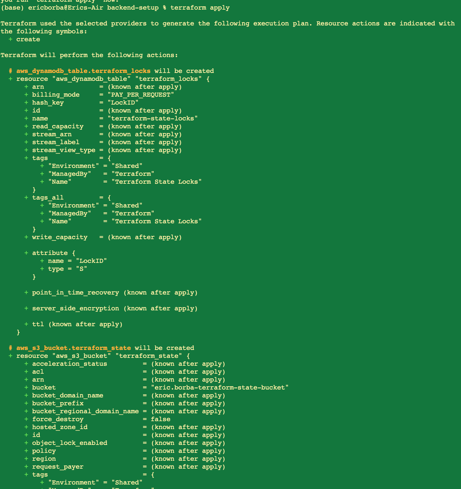
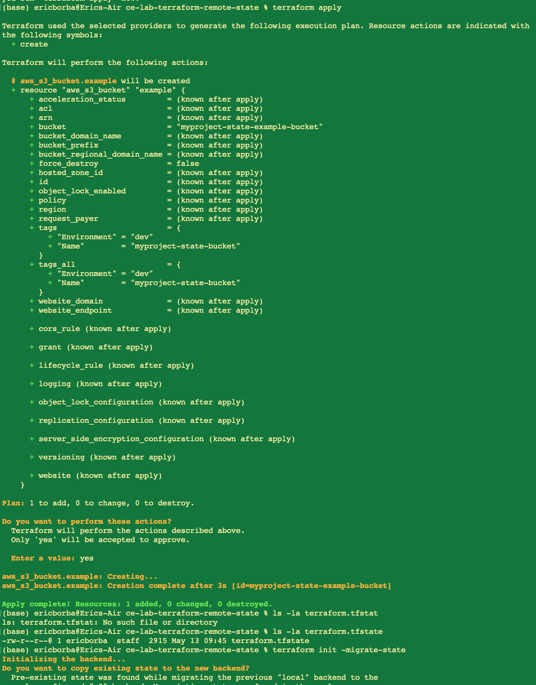
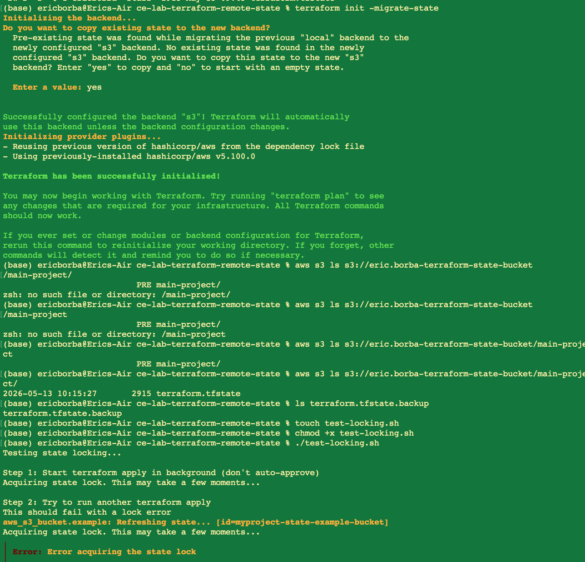
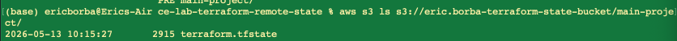
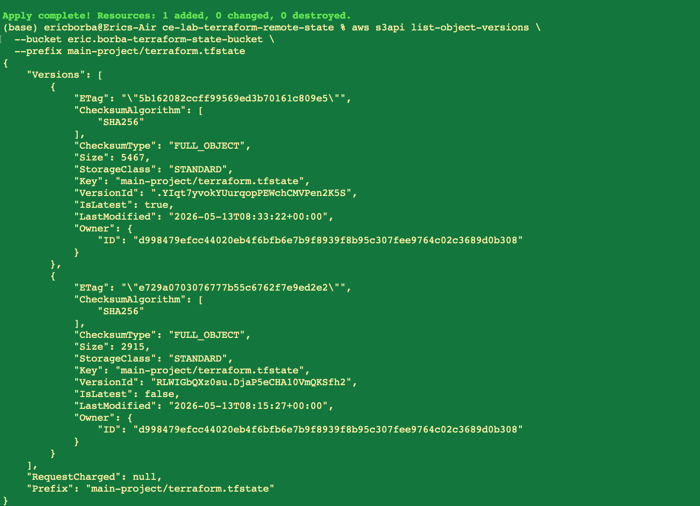
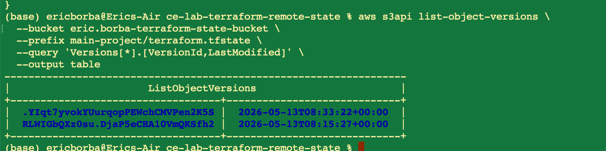
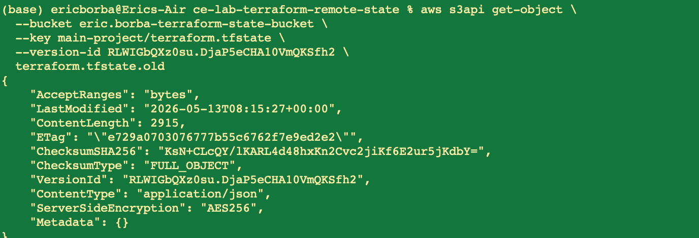
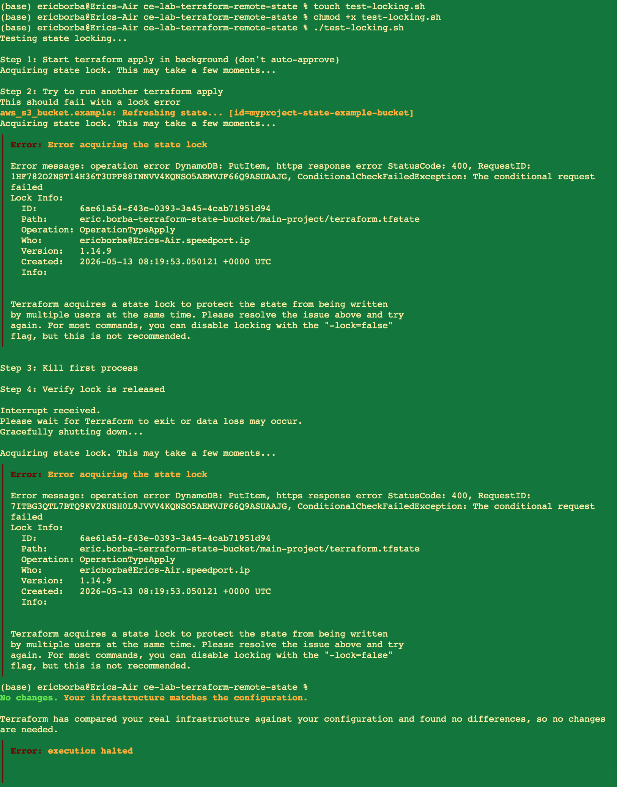
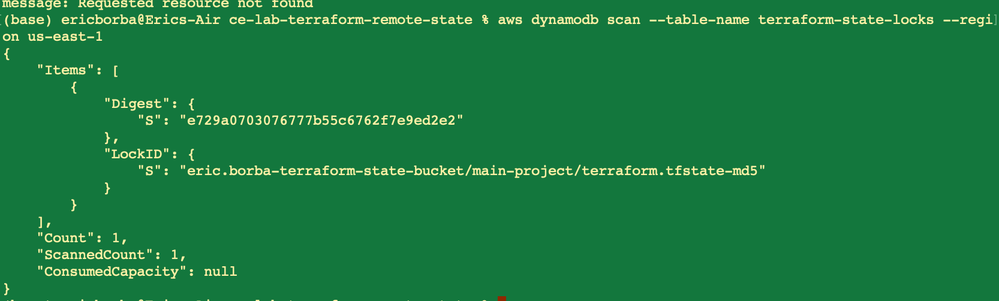

# Lab M4.03 - Configure Remote State: Solution

**Student:** Eric Borba  
**Date:** 2026-05-13  
**Course:** Cloud Engineering Bootcamp - Week 4  
**Module:** Infrastructure as Code with Terraform

---

## Overview

This lab configures Terraform remote state storage using AWS S3 for state persistence and DynamoDB for state locking, enabling safe collaboration across multiple team members.

---

## Architecture

```
┌─────────────────────────────────────────────────┐
│                 Remote Backend                  │
│                                                 │
│  ┌──────────────────────┐  ┌─────────────────┐  │
│  │  S3 Bucket           │  │ DynamoDB Table  │  │
│  │  (terraform.tfstate) │  │ (state locking) │  │
│  └──────────────────────┘  └─────────────────┘  │
└─────────────────────────────────────────────────┘
            ▲                        ▲
            │                        │
     terraform init -migrate-state   │
     terraform apply                 │
            │                        │
     ┌──────┴────────────────────────┘
     │  Terraform CLI (local)
     └──────────────────────
```

---

## Task 1 — Bootstrap Backend Infrastructure

The backend infrastructure (S3 + DynamoDB) was provisioned first using a separate Terraform configuration located in [backend-setup/main.tf](backend-setup/main.tf). This separation ensures the backend resources are managed independently from the main project state.

### Resources created

**S3 Bucket** (`eric.borba-terraform-state-bucket`):
- Versioning enabled — every state change is preserved
- AES-256 server-side encryption at rest
- All public access blocked

**DynamoDB Table** (`terraform-state-locks`):
- Billing mode: `PAY_PER_REQUEST`
- Hash key: `LockID` (String) — used by Terraform to create/release locks

### Command

```bash
cd backend-setup
terraform init
terraform apply
```

### Output



Both `aws_dynamodb_table.terraform_locks` and `aws_s3_bucket.terraform_state` were created successfully.

---

## Task 2 — Configure the S3 Backend

The main project's [main.tf](main.tf) was updated with an S3 backend block pointing to the resources created in Task 1:

```hcl
terraform {
  required_version = ">= 1.6.0"

  backend "s3" {
    bucket         = "eric.borba-terraform-state-bucket"
    key            = "main-project/terraform.tfstate"
    region         = "us-east-1"
    encrypt        = true
    dynamodb_table = "terraform-state-locks"
  }
  ...
}
```

| Parameter | Value |
|---|---|
| `bucket` | `eric.borba-terraform-state-bucket` |
| `key` | `main-project/terraform.tfstate` |
| `region` | `us-east-1` |
| `encrypt` | `true` |
| `dynamodb_table` | `terraform-state-locks` |

---

## Task 3 — Apply Local State First

Before migrating, a `terraform apply` was executed with the local backend to create the initial state file and the example S3 bucket resources defined in [main.tf](main.tf).

### Command

```bash
terraform apply
```

### Output



`aws_s3_bucket.example` (`myproject-state-example-bucket`) was created and a local `terraform.tfstate` file was generated.

---

## Task 4 — Migrate State to S3

With the backend block now configured in [main.tf](main.tf), `terraform init -migrate-state` was run. Terraform detected the existing local state and prompted to copy it to the new S3 backend.

### Command

```bash
terraform init -migrate-state
```

### Output



Key events during migration:
- Terraform detected the pre-existing local backend state
- Prompted: *"Do you want to copy existing state to the new backend?"* — answered **yes**
- Backend `s3` was successfully configured
- Terraform re-initialized and downloaded provider plugins

### Verifying the migrated state in S3

```bash
aws s3 ls s3://eric.borba-terraform-state-bucket/main-project/
```



The `terraform.tfstate` file (2915 bytes) was confirmed present in the S3 bucket under the `main-project/` prefix, timestamped `2026-05-13 10:15:27`.

---

## Task 5 — Verify S3 Versioning

S3 versioning ensures every state write is preserved as an immutable object version, enabling rollback if a state becomes corrupt.

### Command

```bash
aws s3api list-object-versions \
  --bucket eric.borba-terraform-state-bucket \
  --prefix main-project/terraform.tfstate \
  --query 'Versions[*].[VersionId,LastModified]' \
  --output table
```

### Output




Two versions were present in the bucket for `main-project/terraform.tfstate`:

| Version ID | Last Modified |
|---|---|
| `YIqt7yvokYUurqopPEWchCMVPen2K5S` | 2026-05-13T08:33:22+00:00 |
| `RLWIGbQXz0su.DjaP5eCHA10VmQKSfh2` | 2026-05-13T08:15:27+00:00 |

This confirms versioning is active and each `terraform apply` produces a new, independently retrievable version.

### Downloading a specific version

A specific historical version was retrieved using:

```bash
aws s3api get-object \
  --bucket eric.borba-terraform-state-bucket \
  --key main-project/terraform.tfstate \
  --version-id RLWIGbQXz0su.DjaP5eCHA10VmQKSfh2 \
  terraform.tfstate.old
```



The response confirmed `ServerSideEncryption: AES256` and returned the object metadata, including the `VersionId` and `ContentLength` (2915 bytes).

---

## Task 6 — Test State Locking

State locking prevents concurrent writes that could corrupt the shared state file. The [test-locking.sh](test-locking.sh) script simulates two simultaneous `terraform apply` operations:

```bash
#!/bin/bash
# Step 1: Start terraform apply in background (no auto-approve)
terraform apply &
FIRST_PID=$!
sleep 3

# Step 2: Try to run another terraform apply concurrently
# This should fail with a lock error
terraform plan

# Step 3: Kill first process
kill $FIRST_PID

# Step 4: Verify lock is released
terraform plan
```

### Command

```bash
chmod +x test-locking.sh
./test-locking.sh
```

### Output



**Expected behavior observed:**

- **Step 1:** First `terraform apply` acquires the state lock and writes a `LockID` entry to DynamoDB.
- **Step 2:** Second `terraform plan` immediately fails with:
  ```
  Error: Error acquiring the state lock
  Operation: OperationTypeApply
  Who: ericborba@Erics-Air.speedport.ip
  Created: 2026-05-13 08:19:53.050121 +0000 UTC
  ```
  Terraform correctly prevented the concurrent operation.
- **Step 3:** The first process was killed, releasing the lock.
- **Step 4:** A subsequent `terraform plan` succeeded — `Your infrastructure matches the configuration.`

### Verifying the lock entry in DynamoDB

```bash
aws dynamodb scan \
  --table-name terraform-state-locks \
  --region us-east-1
```



During an active lock, DynamoDB contained:

```json
{
  "Items": [{
    "Digest": { "S": "e729a0703076777b55c6762f7e9ed2e2" },
    "LockID": { "S": "eric.borba-terraform-state-bucket/main-project/terraform.tfstate-md5" }
  }],
  "Count": 1
}
```

After the process was killed and the lock released, the item was removed automatically by Terraform.

---

## Summary

| Task | Status | Evidence |
|---|---|---|
| S3 bucket created with versioning & encryption | Done | `applyingBackend.png` |
| DynamoDB table created for locking | Done | `applyingBackend.png` |
| S3 backend block configured in `main.tf` | Done | `main.tf` |
| Local state migrated to S3 | Done | `migriting.png`, `verifyingMigration.png` |
| S3 versioning verified (multiple versions present) | Done | `checkingVersioning.png`, `checkingVersioningTimeStamp.png` |
| State locking tested and confirmed | Done | `testingLocking.png`, `checkingLocks.png` |
| Historical version retrieved from S3 | Done | `downloadingSpecificVersion.png` |

---

## Key Takeaways

- **Remote state** eliminates the risk of multiple team members holding divergent local state files.
- **S3 versioning** acts as an automatic backup for every state write, making rollback straightforward with `aws s3api get-object --version-id`.
- **DynamoDB locking** enforces exclusive access — only one Terraform operation can modify state at a time, preventing corruption from concurrent runs.
- The **backend bootstrap** should be in a separate directory with its own state so that the backend infrastructure is never managed by the backend it enables.
